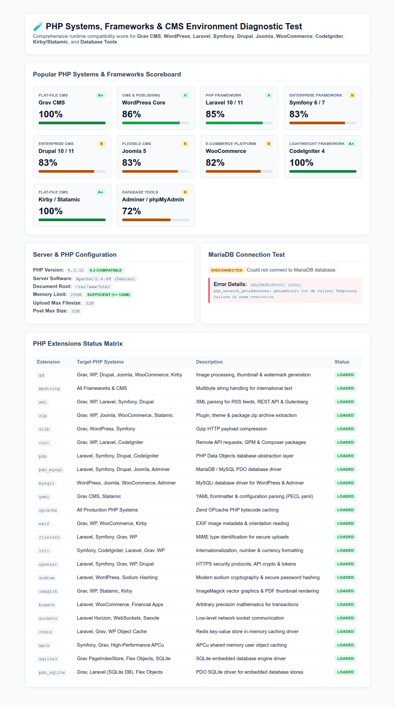

# Unified Diagnostic Test Script

This directory contains the unified PHP environment diagnostic script (`test.php.example`) to verify PHP extensions, server settings, and database connectivity for **Grav CMS**, **WordPress**, **Laravel**, **Symfony**, **Drupal**, **Joomla**, **WooCommerce**, **CodeIgniter**, **Kirby/Statamic**, and **Database Tools** before deployment.

---

## Supported PHP Systems & Frameworks

The diagnostic suite automatically calculates real-time **Compatibility Scores & Letter Grades** for:

1. **CMS & Publishing Platforms**:
   - **Grav CMS**: Flat-file CMS runtime (requires `gd`, `mbstring`, `xml`, `zip`, `zlib`, `curl`, `yaml`).
   - **WordPress Core**: World's #1 CMS (requires `mysqli`, `gd`, `mbstring`, `xml`, `zip`, `curl`).
   - **Drupal 10 / 11**: Enterprise CMS (requires `pdo_mysql`, `gd`, `mbstring`, `xml`, `openssl`).
   - **Joomla 5**: Flexible CMS (requires `mysqli`, `pdo_mysql`, `gd`, `xml`, `zip`, `mbstring`).
   - **Kirby / Statamic**: Flat-file publishing platforms (requires `gd`, `mbstring`, `exif`, `zip`, `curl`).

2. **PHP Frameworks**:
   - **Laravel 10 / 11**: Modern PHP framework (requires `mbstring`, `openssl`, `pdo`, `pdo_mysql`, `xml`, `fileinfo`, `curl`).
   - **Symfony 6 / 7**: Enterprise framework (requires `mbstring`, `openssl`, `pdo`, `pdo_mysql`, `xml`, `intl`).
   - **CodeIgniter 4**: Lightweight framework (requires `intl`, `mbstring`, `curl`, `pdo`).

3. **E-Commerce & Database Tools**:
   - **WooCommerce**: WordPress e-commerce store platform.
   - **Adminer / phpMyAdmin**: Web-based database management tools.

---

## Diagnostic Script (`test.php.example`)



* **File**: `test-scripts/test.php.example`
* **Purpose**: Comprehensive diagnostic page checking system compatibility for popular PHP frameworks, CMS platforms, and MariaDB.

### How to Run:
Deploy the test script to your application root directory (`src/`):

```bash
# Using Makefile:
make test

# Or manual copy:
cp test-scripts/test.php.example src/test.php
```

Access via browser at **[http://localhost/test.php](http://localhost/test.php)**.

---

## Clean Up Test Script
Once testing is complete, remove the file from your `src/` directory:

```bash
# Using Makefile:
make clean-test

# Or manual remove:
rm src/test.php
```
